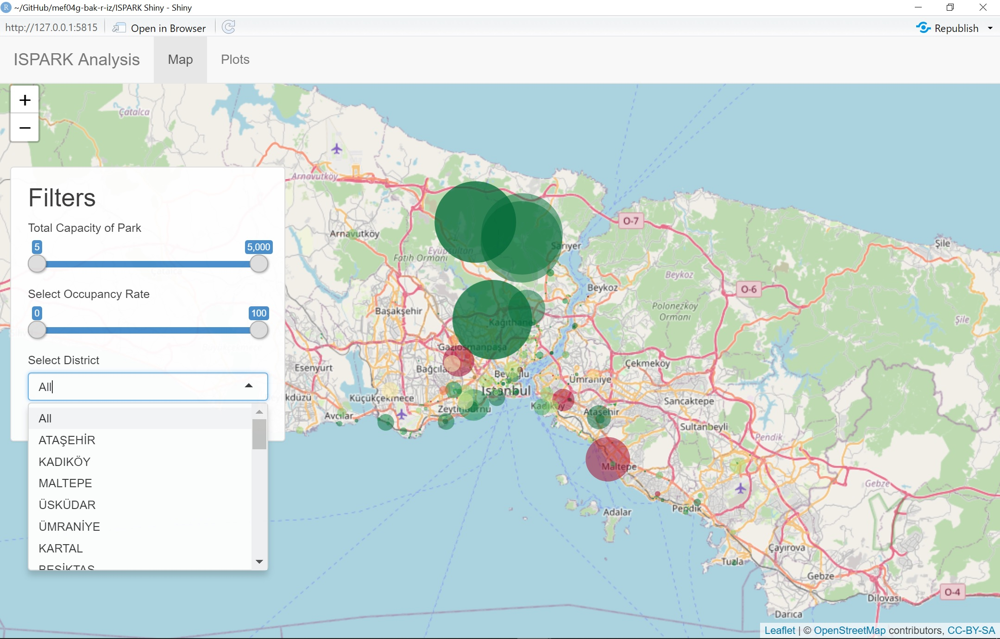
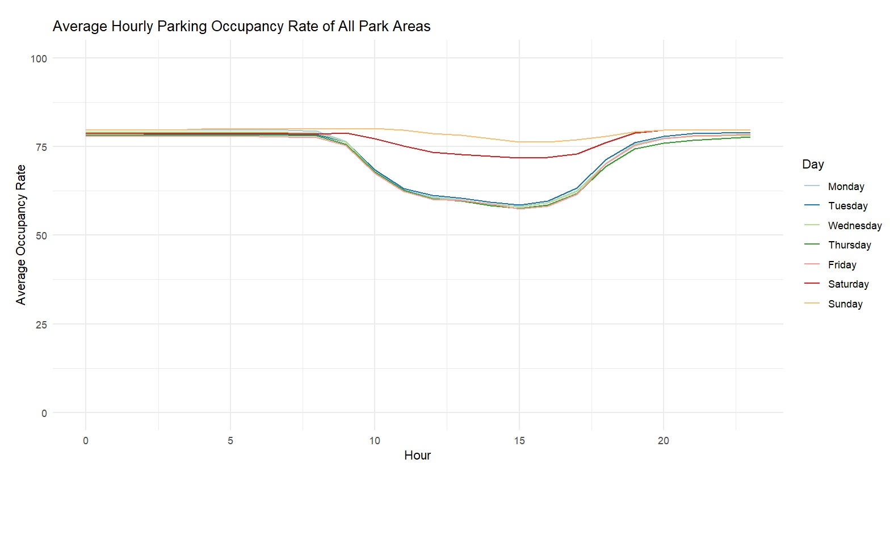

---

title: "ISPARK Data Analysis Presentation"
subtitle: "Group bak-R-ız"
institute: "Mef University"
date: "2020/12/26"
output:
  xaringan::moon_reader:
    lib_dir: libs
    nature:
      highlightStyle: github
      highlightLines: true
      countIncrementalSlides: false

---

class: inverse, center, middle

# ISPARK PROJECT

# B - a - k - R - ı - z
   
## Group Members

Alihan BÜYÜKEKEN

Bilgen YILMAZ

Buğra BALANTEKİN

Hüseyin EROĞLU

İdil KAZEZYILMAZ

---


class: inverse, center, middle


```{r eval=TRUE, echo=FALSE, message=FALSE, warning=FALSE}
library(tidyverse)
load("~/GitHub/mef04g-bak-r-iz/ISPARK.RData")
isparkbilgileri <- isparkparkbilgileri
```


---

class: inverse, center, middle

# Table of Contents

Brief Information About Dataset

Our Mission

Tables & Plots

Shiny App


---

class: inverse, center, middle

# Brief Information About Dataset

We have two tables in our dataset. First table contains informations about ISPARK park areas. Second table contains hourly percentage of occupancies of these park areas between 19 November 2020 and 2 December 2020. We have collected this data by using IBB OpenData API. You can also access this API from [here.](https://api.ibb.gov.tr/ispark/Park)

---


class: inverse, center, middle

# Our Mission

Understanding the relation between the park capacity and the other metric. Creating shiny app that recommends best suitable parking spots with given limits. You can check our app from [here.](https://alihan.shinyapps.io/ISPARK-Shiny/)

---

class: inverse, left, middle

# Park Type Summary Table

We can see the count, total capacity and avg. monthly price in below table.

We have 5 different park types. 

"ON ROAD" type park is the highest with number of the parks also with pricing. 

"OPEN OTOPARK" type is the highest with the total capacity.

```{r parkinfosum, out.width="55%", echo=FALSE, message=FALSE, warning=FALSE, format = 'html'}

parkinfo_tip <- isparkbilgileri %>% group_by(ParkTipi) %>% summarize("Toplam Kapasite"=sum(Kapasitesi), "Ortalama Kapatise"=mean(Kapasitesi), "Ortalama Ücretsiz Park Suresi" = mean(UcretsizParklanmaDk), "Ortalama Aylik Ucret" = mean(AylıkAbonelikÜcreti))
parktipi_adet <- isparkbilgileri %>% group_by(ParkTipi) %>% count(ParkTipi, sort = TRUE)
#parkinfo_tip %>% left_join(parktipi_adet) 
parktipi_adet %>% left_join(parkinfo_tip) %>% rename("Park Adeti"=n) 
```


---

class: inverse, left, middle

# Boxplot of Avg. Monthly Price

Open Park has a lower mean of monthly price than 'Close Park' and 'Road Park'.
Close Park's monthly price has outliers. But despite those outliers, its monthly prices varies the least.

```{r, out.width="50%", echo=FALSE}
isparkbilgileri %>% filter(ParkTipi %in% c("AÇIK OTOPARK","KAPALI OTOPARK","YOL ÜSTÜ")) %>% ggplot(., aes(ParkTipi,AylıkAbonelikÜcreti)) +
  geom_boxplot()

```

---

class: inverse, left, middle

# Free/ Paid Parking Areas

We have 196 free, 381 paid parks in Istanbul.

%52 of the free parks are On Road Type of park. %40.8 of the free parks are Open Parks.

```{r ucretdurumu, figures-side, fig.show="hold", out.width="50%", message=FALSE, warning=FALSE, echo=FALSE}
ucretdurumu <- isparkbilgileri %>% transmute(ucretDurumu = ifelse(AylıkAbonelikÜcreti == 0,"Free","Not Free"))
ucretdurumutab <- ucretdurumu %>% group_by(ucretDurumu) %>% count(ucretDurumu)

ggplot(ucretdurumutab, aes(x=reorder(ucretDurumu, n, fill=ucretDurumu), y=n))+
  geom_bar(stat="identity", position = "dodge")+
  labs(title="Free Parks",x ="Free/ Not Free", y = "Count")

ucretdurumu2 <- isparkbilgileri %>% transmute(ParkTipi, ucretDurumu = ifelse(AylıkAbonelikÜcreti == 0,"Free","Not Free"))
ucretdurumutab2 <- ucretdurumu2 %>% group_by(ParkTipi, ucretDurumu) %>% count(ucretDurumu)

ggplot(ucretdurumutab2, aes(x=reorder(ucretDurumu, n), y=n, fill=ParkTipi))+
  geom_bar(stat="identity", position = "dodge")+
  labs(title="Free/ Not Free Status by Park Type",x ="Free/ Not Free", y = "Count")

```

---
class: inverse, left, middle

# Occupancy Rates

In all park types, average parking occupancy rate during daytime (around 15:00) is less than nights.

We can say on week days occupancy is lower than weekend days.

```{r hourday, figures-side, fig.show="hold", out.width="50%", message=FALSE, warning=FALSE, echo=FALSE}
mergedtable <- merge(x = parkcapacitylog, y = isparkbilgileri, by = "ParkID", all.x = TRUE)
merged_park_capacity_hourly <- mergedtable %>%
  group_by(hour = lubridate::hour(OlcumZamanı), ParkTipi) %>%
  summarize( avd_doluluk_orani =mean(DolulukYuzdesi)) %>% filter(ParkTipi != "NA")
ggplot(merged_park_capacity_hourly, aes(hour, avd_doluluk_orani, color=ParkTipi)) +
  geom_line() +
  labs(x="Hour", y="Average Occupancy Rate") +
  labs(title = "Hourly Parking Occupancy Rate by Ispark Types")


merged_park_capacity_daily <- mergedtable %>% 
  group_by(wday = lubridate::wday(OlcumZamanı), ParkTipi) %>%
  summarize( avd_doluluk_orani =mean(DolulukYuzdesi)) %>% filter(ParkTipi != "NA")
  ggplot(merged_park_capacity_daily, aes(wday, avd_doluluk_orani, color=ParkTipi)) +
  geom_line() +
  labs(x="Week Day", y="Average Occupancy Rate") +
  labs(title = "Daily Parking Occupancy Rate by Ispark Types")


```

---

class: inverse, left, middle

# Frequency of the Parks by District

If we look at the frequencies of the parks Fatih district has the highest park number After Fatih, Besiktas and Sisli districts are amongst highest. 

Arnavutkoy and Sultangazi are almost equal and has the lowest frequency.

```{r, figures-side, fig.show="hold", out.width="50%", message=FALSE, warning=FALSE, echo=FALSE}
isparkbilgileri %>% group_by(Ilce) %>% count() %>% 
       ggplot(mapping = aes(x = reorder(Ilce, n), y=n)) + geom_bar(stat = "identity", fill="green") +
       labs(title="Frequency of Park Areas")  +
       coord_flip() + 
       ylab("Park Area Count") +
       xlab("District") +
       theme_minimal()
```


---

class: inverse, left, middle

# Shiny App: Park Finder

We wanted to create an app to find best park location suits user's selection, while giving information about that park.

**For map, inputs are: **


`Total Capacity` : Total capacity of the park

`Occupancy Rate` : Occupancy rate of the park

`District` : Park's location as district

**For plots, inputs are:**


`District` : Park's location as district

`Park Area Name` : Park's name


---


class: inverse, center, middle

#SHINY APP MAP

The shiny app built can filter Districts, Total Capacity of Parks and Occupancy Rate

.center[]

---
class: inverse, center, middle

#SHINY APP PLOT
The Plot shows us that hourly average occupancy of all parks outside the working hours is around 75 pct. During the working hours occupancy rate falls below 60 pct. Saturday and Sunday have a different tendency. Sunday follows a linear trend almost in which occupancy level swings between 75-78 pct. 

.center[]
---
class: inverse, center, middle
#PURPOSE OF SHINY APP

* Main purpose of our App is to show parks in Istanbul map according to their occupancy rate, Total Capacity and District.


* Map part of our App also has a pop-up feature when clicked on to the green/red spot gives basic information about the mentioned park. The map can also zoom in/out when filters change accordingly


* Plot part of the app has two main filter; District and Parks of the selected District. When filtered the plot visualizes the average occupancy of given park for every weekday hourly. If none of the filters are selected the plot shows the total average occupancy levels of all parks.

---


class: inverse, center, middle

# Key Findings

* Total number of minibus and Taxi type of parks in Istanbul make the %2 of the total parks.
* Fatih (%17) - Besiktas (%11) - Sisli (%11) - Bakirköy (%6.58) - Kadiköy (%6.58) are the top 5 districts that have the most park number %52 of the total number. But on the other hand capacity-wise Eyup has the biggest park capacity. We can say touristic areas has an advantage in terms of parking.
* %33.96 of the parks are free. And On-Road or open parks are more likely to be free.
* At 15:00 occupancy rate is the lowest for all park types expect Taxi parks. And closed parks are most likely to have empty space than others.
* Open parking lots and parking garages are common in touristic and crowded places.
* Roadside parking lots are common in less crowded areas.


---

class: inverse, center, middle

# Thank You!

[Our Group Page](https://pjournal.github.io/mef04g-bak-r-iz/)

